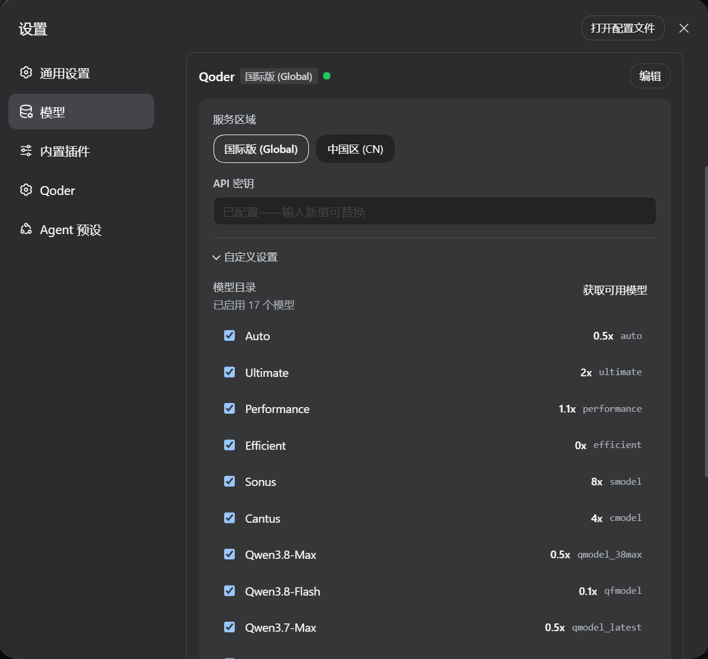
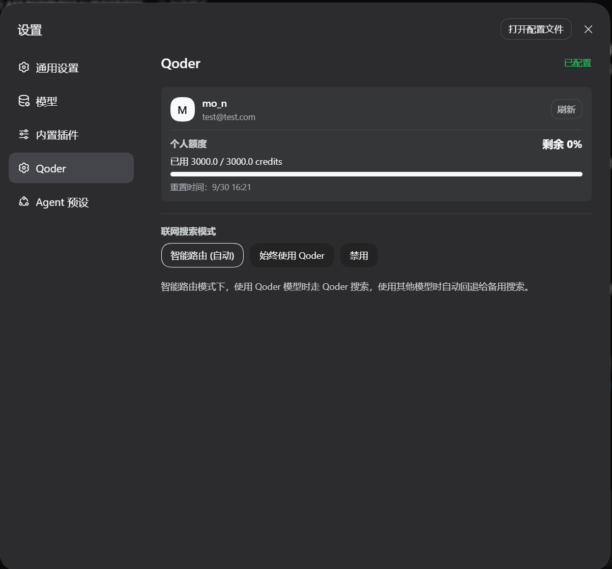

# dsh-provider-qoder

[](https://www.npmjs.com/package/dsh-provider-qoder)
[](LICENSE)
[](https://awesome-dsh-plugin.com)

English | [简体中文](./README_CN.md)

Use your Qoder subscription in DeepSeek Harness (DSH), supporting multimodality, web search, and tool calls across Global and China Qoder services.

The plugin handles authentication and model communication, while tool execution, workspace operations, and permission management are handled by DSH.
This project is a community adapter plugin and is not affiliated with Qoder or DeepSeek.

## Features

- Configure subscription access via Qoder Personal Access Token (PAT).
- Supports both Global (`global`) and China (`china`) services.
- Discovers available models for your account, allows selecting enabled models, and displays pricing multipliers and reasoning effort options when reported by the service.
- Supports multimodality, search, and tool calls.
- View account information, quota, and reset dates in Settings.

## Installation

### Prerequisites

You will need a running DSH Web environment, an active Qoder subscription, and a PAT matching the selected service region. The DSH profile running the plugin must provide a managed credentials service; when configuring via the settings page, the credential storage must also be writable.

This package's dependency ranges are DSH packages `>=0.1.2-rc.1 <0.2`, Cordis `>=4.0.2 <5`, and React `^18.2.0`. The settings UI also depends on the host providing remote credential endpoints and settings slots—please use a DSH version equipped with these interfaces; the ranges above do not imply that every version has been tested.

### Install from npm

Run in your terminal:

```sh
dsh plugin --profile web add dsh-provider-qoder
```

## Configuration & Usage

### 1. Save Service Region and PAT

Open DSH Web, navigate to **Settings → Models**, locate the **Qoder Credentials** card at the bottom of the page, and click **Edit**.

| Service Region | Account Domain |
| --- | --- |
| Global (default) | `qoder.com` |
| China (CN) | `qoder.com.cn` |

Select the region matching your account, enter your Qoder PAT into the input box labeled **API Key**, and click **Save**.

### 2. Fetch and Select Models

1. After saving the PAT and service region, click **Edit** again.
2. Expand **Custom Settings** and click **Fetch Available Models**.
3. Select the models you want to enable (keep at least one), then click **Save**.
4. Select a Qoder model in the DSH model picker to start chatting.

Fetching models uses the **saved PAT and service region**. If you switch accounts or regions, you need to fetch models again. The initial model catalog is only a candidate reference; actual available models are subject to account query results. Model multipliers, reasoning effort options, and image-input capability are provided by Qoder and may not be available for all models.

The model picker refreshes Qoder metadata for enabled models when opened, with a five-minute cache after a successful fetch. When settings are writable, refreshed multipliers and capabilities are also synchronized to the saved catalog shown in **Custom Settings**, without enabling additional models. Failed refreshes retain the last known metadata.

<p align="center">
  
</p>

### 3. View Account & Quota

Open **Settings → Qoder** to view account and quota details, and configure the web search policy as needed:

<p align="center">
  
</p>

## Upcoming Features

- [ ] Context window tier switching
- [ ] Request rate-limiting queue mechanism
- [ ] Connect with Qoder's Protobuf protocol

## References

- [pi-provider-qoder](https://github.com/simonsmh/pi-provider-qoder) - Reference implementation for Qoder authentication, API communication, and protocol handling.

## Feedback

Please report issues via [GitHub Issues](https://github.com/mo-n/dsh-provider-qoder/issues) with the plugin and DSH versions, selected service region, reproduction steps, and sanitized error messages. Do not submit PATs, short-lived tokens, or personal account information.

This project is licensed under the MIT License.
