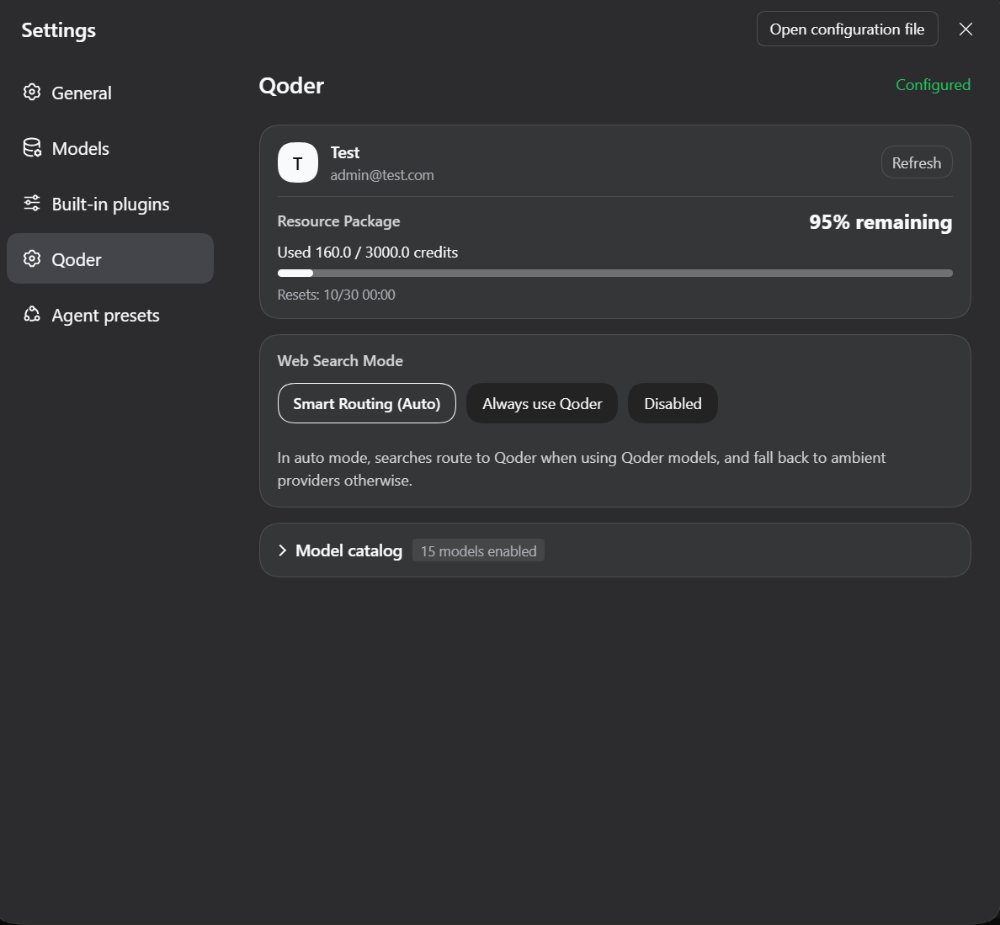

# dsh-provider-qoder

[](https://www.npmjs.com/package/dsh-provider-qoder)
[](LICENSE)
[](https://github.com/mo-n/dsh-provider-qoder)
[](https://awesome-dsh-plugin.com)

English | [简体中文](./README_CN.md)

Use your Qoder subscription in DeepSeek Harness (DSH), supporting multimodality, web search, and tool calls across Global and China Qoder services.

The plugin handles authentication and model communication, while tool execution, workspace operations, and permission management are handled by DSH.
This project is a community adapter plugin and is not affiliated with Qoder or DeepSeek.

## Features

- Configure subscription access via Qoder Personal Access Token (PAT).
- Supports both Global (`global`) and China (`china`) services.
- Automatically fetches available models for your account, supports selecting enabled models, and displays pricing multipliers and reasoning effort options when reported by the service.
- Supports multimodality, web search, and tool calls.
- View account information, quota, and reset dates in Settings.

## Installation

### Prerequisites

- An active Qoder subscription and a PAT matching the selected service region.
- The DSH profile running the plugin must provide a managed credentials service; when configuring via the settings page, the credential storage must also be writable.
- Requirements: DSH `>=0.1.7-rc.2`.

### Install from npm

Run in your terminal:

```sh
dsh plugin --profile web add dsh-provider-qoder
```

## Configuration & Usage

### 1. Save Service Region and PAT

Open DSH Web, navigate to **Settings → Models**, locate the **Qoder Credentials** card at the bottom of the page, and click **Edit**.

| Service Region | Account Domain |
| --- | --- |
| Global (default) | `qoder.com` |
| China (CN) | `qoder.com.cn` |

Select the region matching your account, enter your Qoder PAT into the input box labeled **API Key**, and click **Save**.

Once saved, the plugin automatically fetches the list of supported models for your account, making them immediately available in the DSH model picker.

### 2. View Account & Manage Models

Open **Settings → Qoder** to view account and quota details, configure the web search policy, and adjust enabled models:

<p align="center">
  
</p>

## Upcoming Features

- [ ] Request rate-limiting queue mechanism
- [ ] Connect with Qoder's Protobuf protocol

## References

- [pi-provider-qoder](https://github.com/simonsmh/pi-provider-qoder) - Reference implementation for Qoder authentication, API communication, and protocol handling.

## Feedback

Please report issues via [GitHub Issues](https://github.com/mo-n/dsh-provider-qoder/issues) with the plugin and DSH versions, selected service region, reproduction steps, and sanitized error messages. Do not submit PATs, short-lived tokens, or personal account information.

## License

This project is licensed under the [MIT License](LICENSE).
