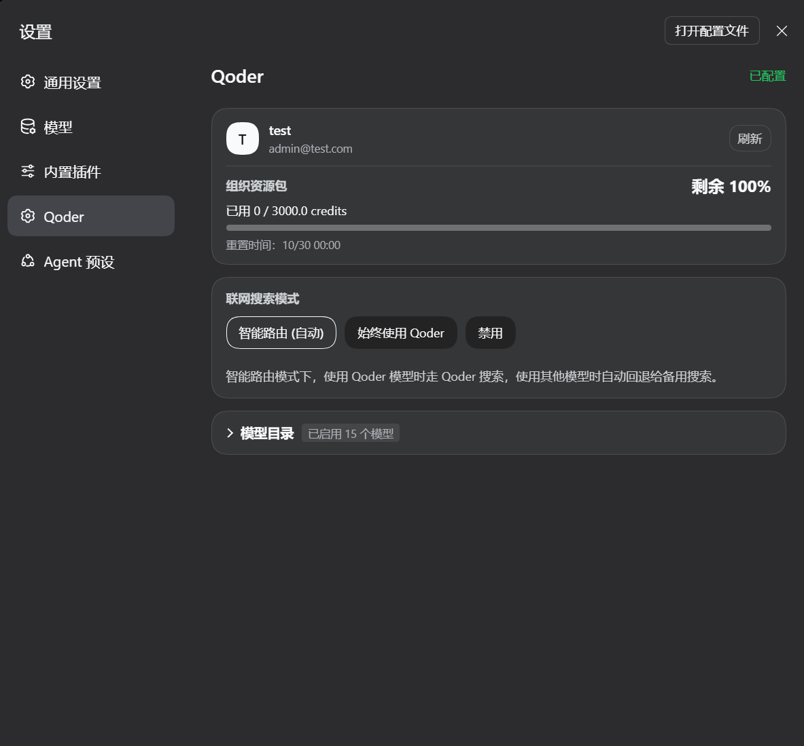

# dsh-provider-qoder

[](https://www.npmjs.com/package/dsh-provider-qoder)
[](LICENSE)
[](https://github.com/mo-n/dsh-provider-qoder)
[](https://awesome-dsh-plugin.com)

[English](./README.md) | 简体中文

在 DeepSeek Harness（DSH）中使用 Qoder 订阅，支持多模态、联网搜索和工具调用，可选择国际版或中国区 Qoder 服务。

插件负责认证和模型通信，工具执行、工作区操作及权限管理由 DSH 负责。
本项目是社区适配插件，与 Qoder、DeepSeek 官方均无关联。

## 功能

- 通过 Qoder Personal Access Token（PAT，个人访问令牌）配置订阅访问。
- 支持国际版（`global`）和中国区（`china`）服务。
- 自动拉取账号可用模型，支持选择启用的模型，并在服务支持时显示价格倍率和推理强度选项。
- 支持多模态、搜索以及工具调用。
- 在设置中查看账号信息、额度和重置时间。

## 安装

### 使用前提

- 拥有可用的 Qoder 订阅，以及与所选服务区域匹配的 PAT。
- 运行插件的 DSH profile 必须提供托管凭据服务；通过设置页面配置时，凭据存储还需可写。
- 环境要求：DSH `>=0.1.7-rc.2`。

### 从 npm 安装

在终端执行：

```sh
dsh plugin --profile web add dsh-provider-qoder
```

## 配置与使用

### 1. 保存服务区域和 PAT

打开 DSH Web 的 **设置 → 模型**，找到页面底部的 **Qoder 凭据** 卡片，点击 **编辑**。

| 服务区域 | 对应账号 |
| --- | --- |
| 国际版（Global，默认） | `qoder.com` |
| 中国区（CN） | `qoder.com.cn` |

选择与账号一致的区域，将 Qoder PAT 填入界面标为 **API 密钥** 的输入框，然后点击 **保存**。

保存后，插件会拉取账号支持的模型列表，即可在 DSH 模型选择器中选用。

### 2. 查看账号与设置模型

打开 **设置 → Qoder** 查看账号额度，并可切换联网搜索策略与调整启用的模型：

<p align="center">
  
</p>

### 3. 选择会话上下文档位

模型提供多个上下文档位时，可在会话输入框旁选择 Context Tier。选择按会话、模型和服务区域隔离；刷新页面会恢复宿主已接受的选择，其他打开的窗口会同步变更。手动选择保存在宿主内存中，重启 DSH 后会按可用请求历史或模型默认档位恢复。

## 后续计划

- [ ] 请求限流排队机制
- [ ] 接入 Qoder 的 Protobuf 协议

## 参考项目

- [pi-provider-qoder](https://github.com/simonsmh/pi-provider-qoder) - Qoder 认证、API 通信及协议处理的参考实现。

## 反馈

请通过 [GitHub Issues](https://github.com/mo-n/dsh-provider-qoder/issues) 提交问题，附上插件和 DSH 版本、所选服务区域、复现步骤及脱敏后的错误信息。不要提交 PAT、短期令牌或个人账号信息。

## 许可证

本项目基于 [MIT License](LICENSE) 开源。
